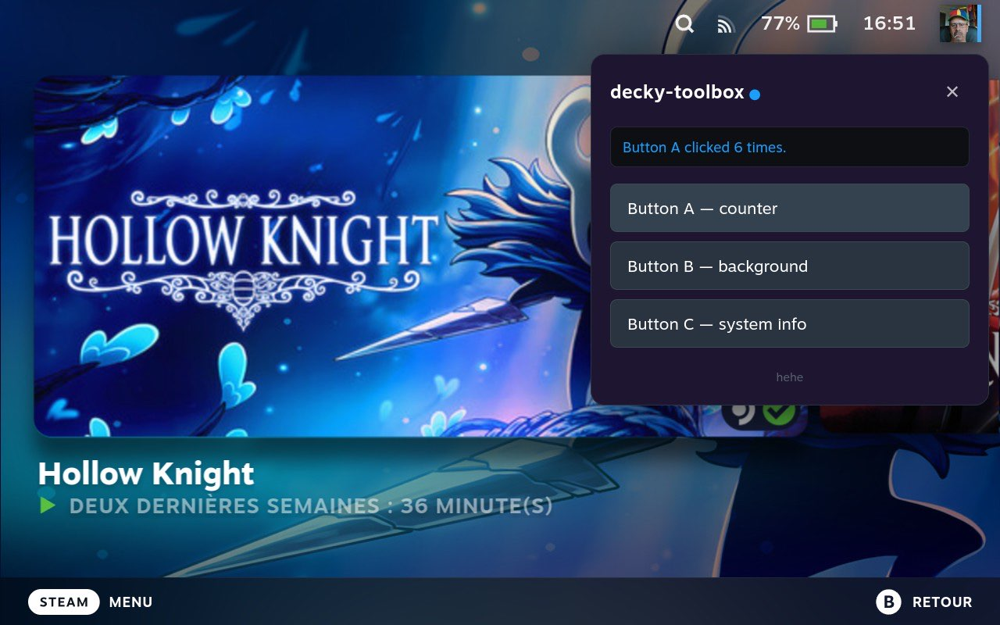
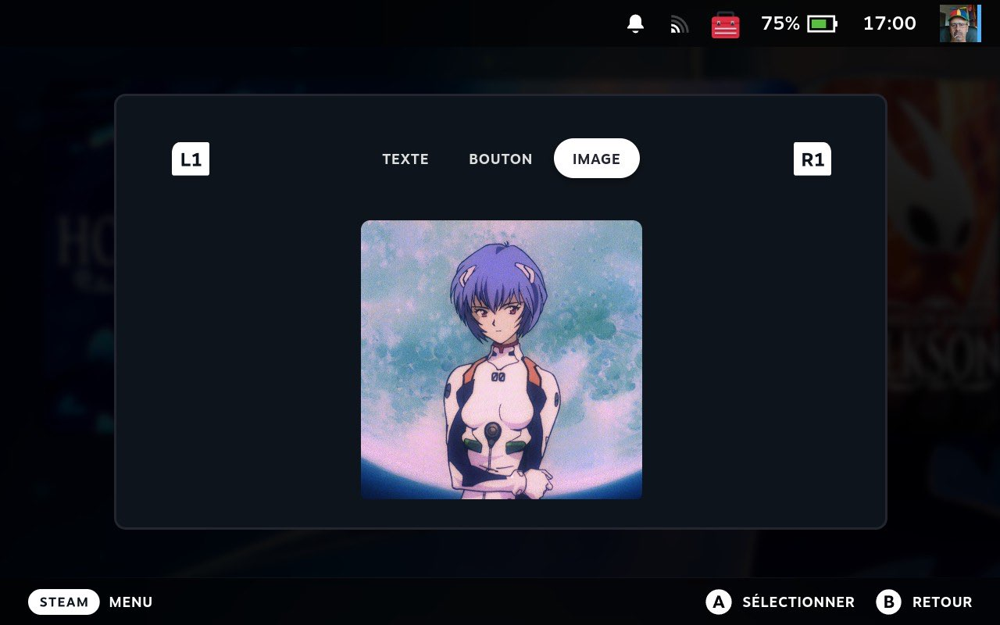

# SteamDeck Javascript Injection



---

## How it works

The Steam Deck UI is a Chromium Embedded Framework (CEF) application. The Gaming Mode shell runs in a page called `Steam : mode Big Picture`, accessible via Chrome DevTools Protocol (CDP) over localhost.

---

## Structure

```
├── frontend/
│   └── inject.js     the script to inject
└── tools/
    ├── cdp.py         WebSocket CDP client
    └── inject_mvp.py  injects inject.js into the Big Picture page
```

---

## Usage

Copy the repo to the Deck via `scp`, then run over SSH. Replace `DECK_IP` with your Deck's local IP address (visible in **Settings → Internet**).

```bash
scp -r steam-dom-inject/ deck@DECK_IP:~/steam-dom-inject
```

```bash
# Inject
ssh deck@DECK_IP "python3 ~/steam-dom-inject/tools/inject_mvp.py"

# Remove
ssh deck@DECK_IP "python3 ~/steam-dom-inject/tools/inject_mvp.py --remove"
```
---

## CDP client

`tools/cdp.py` is a minimal WebSocket client for the Chrome DevTools Protocol, written in pure Python stdlib.

```python
from cdp import CDPClient, get_targets, extract_value

targets = get_targets()
with CDPClient(targets[0]["webSocketDebuggerUrl"]) as c:
    result = c.evaluate("1 + 1")
    print(extract_value(result))  # 2
```

## What's next ?
Pure DOM elements are not recognized by the Steam Deck controller's navigation system. I am currently reverse-engineering the Steam Deck's internal React components so that they can be used and integrated natively. Here's a preview of a modal integration with tabs accessible from the top bar:

